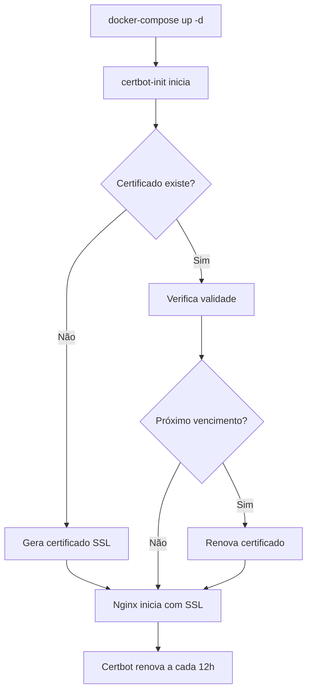

# 🔐 Guia de Instalação SSL - Gestão de Serviços (AUTOMATIZADO)

## 📋 Informações
- **Domínio**: osonline.douradoscalhas.com.br
- **Método**: Certbot em Container (AUTOMATIZADO)
- **Portas**: 80 (HTTP) e 443 (HTTPS)

---

## 🚀 Instalação Automática (3 passos!)

### 1️⃣ Configurar email no init-ssl.sh
```bash
nano init-ssl.sh

# Substituir:
EMAIL="seu-email@exemplo.com"

# Por (exemplo):
EMAIL="admin@douradoscalhas.com.br"

# Salvar: CTRL+O, ENTER, CTRL+X
```

### 2️⃣ Tornar script executável
```bash
chmod +x init-ssl.sh
```

### 3️⃣ Subir os containers
```bash
# Parar App 1 temporariamente (liberar porta 80)
# docker stop <container_app1>

# Subir tudo
docker-compose up -d
```

**Pronto!** O certificado será gerado automaticamente na primeira execução! 🎉

---

## 🔄 Como Funciona

### **Primeira execução:**
1. Container `certbot-init` inicia
2. Verifica se já existe certificado
3. Se não existir, gera automaticamente (modo standalone)
4. Nginx inicia e já usa o certificado

### **Próximas execuções:**
1. Container `certbot-init` verifica certificado existente
2. Se válido, pula geração
3. Se próximo do vencimento, renova automaticamente
4. Container `certbot` renova a cada 12h automaticamente

---

## ⚙️ Ativar SSL no Nginx (após gerar certificado)

```bash
# Verificar se certificado foi gerado
ls -la certbot/conf/live/osonline.douradoscalhas.com.br/

# Se existir, ativar SSL
cp nginx/conf.d/default.conf.ssl nginx/conf.d/default.conf

# Reiniciar Nginx
docker-compose restart nginx
```

---

## ✅ Verificar Status

```bash
# Ver logs da inicialização SSL
docker-compose logs certbot-init

# Ver se certificado foi gerado
docker-compose exec certbot-init certbot certificates

# Testar HTTPS
curl -I https://osonline.douradoscalhas.com.br

# Status dos containers
docker-compose ps
```

---

## 🐛 Troubleshooting

### Certificado não foi gerado na primeira vez

```bash
# Ver logs de erro
docker-compose logs certbot-init

# Possíveis causas:
# 1. Porta 80 ocupada (App 1 ainda rodando)
# 2. DNS não aponta para o servidor
# 3. Firewall bloqueando porta 80

# Tentar novamente:
docker-compose restart certbot-init
```

### Forçar regeneração do certificado

```bash
# Remover certificado existente
rm -rf certbot/conf/live/osonline.douradoscalhas.com.br
rm -rf certbot/conf/archive/osonline.douradoscalhas.com.br
rm -rf certbot/conf/renewal/osonline.douradoscalhas.com.br.conf

# Recriar
docker-compose restart certbot-init
```

---

## 📁 Estrutura de Arquivos

```
gestao_servicos/
├── init-ssl.sh                  # Script de inicialização (NOVO!)
├── docker-compose.yml           # Configurado para SSL automático
├── certbot/
│   ├── conf/                    # Certificados SSL (gerados automaticamente)
│   └── www/                     # Validação HTTP
├── nginx/
│   └── conf.d/
│       ├── default.conf         # HTTP (temporário)
│       └── default.conf.ssl     # HTTPS (ativar após gerar certificado)
└── SSL_SETUP.md                 # Este arquivo
```

---

## 🎯 Fluxo Completo



---

## 🆚 Comparação: Manual vs Automático

| Aspecto | Manual | **Automático (Este Setup)** |
|---------|--------|------------------------------|
| Comandos | 8+ comandos | **3 comandos** |
| Tempo | ~10 minutos | **~2 minutos** |
| Erros | Muitos possíveis | **Auto-recuperação** |
| Renovação | Cron manual | **Automática** |
| Manutenção | Alta | **Zero** |

---

## 🎉 Resultado Final

- ✅ **Certificado gerado automaticamente** na primeira execução
- ✅ **Renovação automática** a cada 12h
- ✅ **Zero manutenção** necessária
- ✅ **Auto-recuperação** em caso de erro

**Basta fazer `docker-compose up -d` e tudo funciona!** 🚀

---

## 📞 Comandos Úteis

```bash
# Ver todos os logs
docker-compose logs -f

# Renovar manualmente
docker-compose exec certbot certbot renew

# Testar renovação
docker-compose exec certbot certbot renew --dry-run

# Parar tudo
docker-compose down

# Reiniciar tudo
docker-compose restart
```
